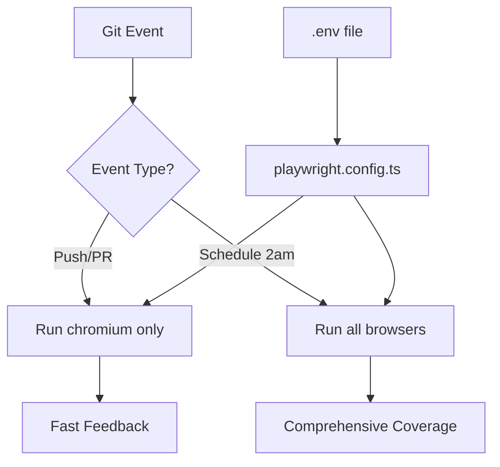

# 🎯 Test Configuration Guide

## Overview

This project uses a **layered configuration system** for flexible test execution across local development and CI/CD environments.

**Priority order (highest to lowest):**

```
CI environment variables → .env file → config.yaml defaults
```

---

## 1️⃣ Primary Configuration: `config.yaml`

`config.yaml` is the **single source of truth** for all test parameters:

```yaml
environment:
  baseUrl: http://localhost:4200
  apiUrl: http://localhost:8000/api

execution:
  fullyParallel: true
  workers: 3 # Limit local concurrency to prevent Docker resource contention
  retries: 1
  timeout: 15000
```

**To change workers locally**, edit `config.yaml` — no environment variable needed.

---

## 2️⃣ Override: `.env` File

**Setup:** Copy `.env.example` to `.env`

```bash
cp .env.example .env
```

**Optional overrides:**

```bash
# Override application URL (e.g. for staging)
BASE_URL=https://staging.example.com

# Override workers (overrides config.yaml value)
WORKERS=4
```

### Usage:

```bash
# Load from .env automatically
npm test

# Override inline
BASE_URL=https://staging.example.com npm test
WORKERS=8 npm test
```

### Supported Parameters:

| Variable   | Description                     | Default (from config.yaml)  |
| ---------- | ------------------------------- | --------------------------- |
| `BASE_URL` | Application URL to test against | `http://localhost:4200`     |
| `WORKERS`  | Number of parallel workers      | `3` (local), `2` (CI)       |
| `CI`       | CI environment flag             | Auto-detected by CI systems |

---

## 2️⃣ CI/CD Browser Strategy

### File: `.github/workflows/playwright-parameterized.yml`

The workflow uses a **smart matrix strategy** for browser testing:

```yaml
browser: ${{ github.event_name == 'schedule'
  && fromJSON('["chromium", "firefox", "webkit"]')
  || fromJSON('["chromium"]') }}
```

### Execution Strategy:

| Trigger                   | Browsers                  | Duration   | Purpose               |
| ------------------------- | ------------------------- | ---------- | --------------------- |
| **Push to main**          | chromium                  | ~5-10 min  | Fast feedback         |
| **Pull Request**          | chromium                  | ~5-10 min  | PR validation         |
| **Scheduled (2am daily)** | chromium, firefox, webkit | ~15-30 min | Cross-browser testing |

---

## 📊 Implementation Flow



### How It Works:

1. **Local Development:**

   ```
   config.yaml (defaults) → .env (overrides) → process.env → playwright.config.ts
   ```

2. **CI/CD Pipeline:**
   ```
   config.yaml (defaults) → GitHub Actions env vars → Matrix Strategy → Browser Selection → Test Execution
   ```

---

## ✅ Best Practices

### Use .env for:

- ✅ Local development defaults
- ✅ Developer-specific configurations
- ✅ Quick testing with different URLs
- ✅ Secrets (never commit!)

### CI/CD Strategy:

- ✅ Push/PR: Fast feedback with chromium only
- ✅ Scheduled (2am): Comprehensive cross-browser testing
- ✅ All browsers run on same codebase daily
- ✅ No manual intervention needed

---

## 🚀 Local Testing Examples

### Example 1: Test Against Staging

```bash
BASE_URL=https://staging.example.com npm test
```

### Example 2: Increase Parallel Workers

```bash
WORKERS=8 npm run test:core
```

### Example 3: Test Specific Browser Locally

```bash
# Run only Firefox tests
npm test -- --project=firefox

# Run only WebKit tests
npm test -- --project=webkit

# Run all browsers
npm test -- --project=chromium --project=firefox --project=webkit
```

### Example 4: Run Specific Test Suites

```bash
# Auth tests only
npm run test:auth

# Articles tests only
npm run test:articles

# Feed tests only
npm run test:feed

# Core features only
npm run test:core
```

---

## 🕐 Scheduled Testing (2am Daily)

The workflow automatically runs comprehensive cross-browser testing at 2am every day:

```yaml
schedule:
  - cron: '0 2 * * *' # 2am UTC daily
```

**What happens:**

1. Code quality checks (TypeScript, ESLint, Prettier)
2. Dependencies cached for faster subsequent runs
3. Docker application automatically started
4. Tests run on all 3 browsers in parallel
5. Browser binaries cached (~70s saved per browser)
6. Test reports uploaded as artifacts (30-day retention)
7. Docker application automatically stopped
8. Summary generated with results

**Benefits:**

- ✅ Catches browser-specific issues early
- ✅ Runs during low-traffic hours
- ✅ No impact on development workflow
- ✅ Comprehensive coverage without slowing down PRs
- ✅ Optimized with caching (~32% faster builds)
- ✅ Docker managed automatically (no manual setup)

**Performance:**

- First run (cold cache): ~255s × 3 = ~765s (12.75 min)
- Subsequent runs (warm cache): ~173s × 3 = ~519s (8.65 min)
- Time saved: ~246s per scheduled run (32% faster)

**See also:** [CI_OPTIMIZATION_GUIDE.md](CI_OPTIMIZATION_GUIDE.md)

---

## 📝 Configuration Best Practices

**Why This Approach?**

1. **Speed + Coverage**: Fast feedback on PRs, comprehensive testing daily
2. **Resource Optimization**: Don't run 3 browsers on every commit
3. **Single Source of Truth**: playwright.config.ts reads from process.env
4. **Security**: .env not committed, secrets safe
5. **Simplicity**: No manual triggers needed, fully automated

**This demonstrates:**

- ✅ Understanding of CI/CD optimization
- ✅ Balance between speed and coverage
- ✅ Security best practices (.env exclusion)
- ✅ Production-ready automation framework
- ✅ Smart resource utilization
